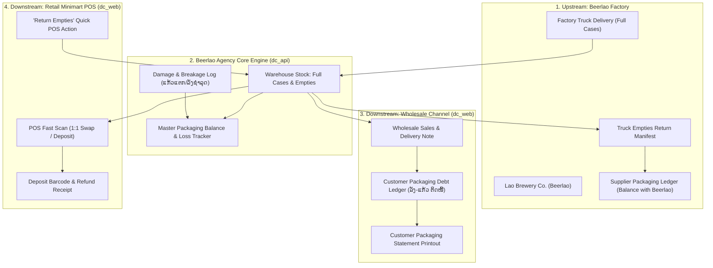
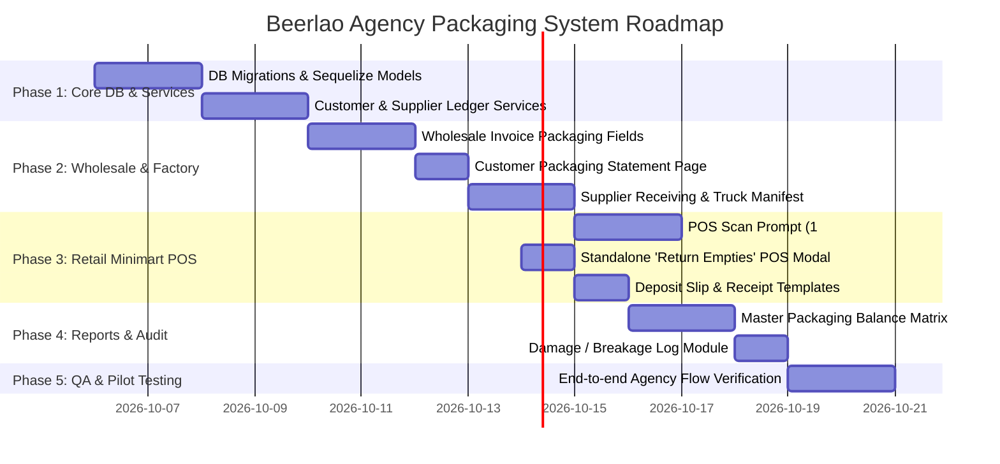

# Beerlao Agency: Returnable Packaging & Bottle/Crate Management Implementation Plan
**System**: Minimart POS, Wholesale Distribution & Inventory System (`dc_api` + `dc_web`)  
**Client Type**: Official Beerlao Agency (ຕົວແທນຈຳໜ່າຍເບຍລາວ - ຂາຍສົ່ງ & ຂາຍຍ່ອຍ)  
**Target Feature**: 2-Way Returnable Packaging Ecosystem (Beerlao Factory ↔ Agency ↔ Wholesale & Retail)

---

## 1. Executive Summary & Problem Statement

As an official **Beerlao Agency**, the business handles both **Wholesale (ຂາຍສົ່ງ)** to sub-shops/restaurants and **Retail Minimart (ຂາຍຍ່ອຍ)** to walk-in consumers.

### Key Pain Points:
1. **Upstream (Beerlao Factory)**: Inability to track packaging quotas and truck return manifests when exchanging empty crates/bottles for new full stock with Lao Brewery Co.
2. **Downstream (Wholesale Clients)**: Restaurants and sub-agents take hundreds of cases on credit, returning partial empties, leading to untracked **Customer Packaging Debt**.
3. **Downstream (Retail POS)**: Cashiers need rapid 1:1 exchange at checkout or deposit receipt tracking.
4. **Internal Loss**: Unrecorded bottle breakages (ແກ້ວແຕກ) and damaged crates (ລັງຊຳລຸດ) create inventory discrepancies with the brewery.

---

## 2. 2-Way Packaging Ecosystem Architecture



---

## 3. Core Functional Modules

### Module A: Wholesale Delivery & Customer Packaging Debt (ບັນຊີລັງ-ແກ້ວຕິດໜີ້)
1. **Invoice & Delivery Note Integration**:
   - In Wholesale Order/Invoice:
     - Full Cases Sent: `100 Cases` (100 Crates + 1,200 Bottles)
     - Empties Collected on Delivery: `80 Crates` + `960 Bottles`
     - **Net Packaging Debt on Bill**: `+20 Crates` + `240 Bottles`
2. **Customer Packaging Statement**:
   - A dedicated report for each restaurant/sub-shop showing:
     - Monetary balance (LAK/THB/USD)
     - Packaging balance (Crates & Bottles owed to the Agency)
3. **Wholesale Empties Pickup Workflow**:
   - Delivery drivers can record standalone empty crate pickups from restaurants, crediting the customer's packaging debt ledger.

---

### Module B: Upstream Beerlao Factory Receiving & Truck Manifest
1. **Purchase Order Receiving Screen**:
   - Record **Full Stock Received** from Beerlao factory truck.
   - Record **Empty Crates & Bottles Handed Over** to the driver.
   - Generate & Print an official **Truck Return Manifest** for the driver to sign.
2. **Beerlao Company Packaging Balance**:
   - Real-time ledger of packaging quotas owed to or held by Lao Brewery.

---

### Module C: Minimart POS Experience (`dc_web/pages/pos/minimart`)
1. **Fast-Lane Checkout**:
   - Scanning Beerlao Case defaults to **"1:1 Empties Exchanged" (ຍົກລັງປ່ຽນ)** for maximum cashier speed.
   - Secondary toggle for **"New Sale with Deposit"** or **"Partial Empties"**.
2. **Standalone POS Action: "Receive Empties / Return Deposit"**:
   - Cashier scans deposit slip barcode or manually inputs crate/bottle count.
   - Dispenses cash refund, updates drawer, and adds empties to stock.

---

### Module D: Packaging Breakage, Loss & Master Audit Matrix
1. **Damage / Breakage Logging**:
   - Cashier/Warehouse manager logs broken bottles or cracked crates.
   - Tagged as `DELIVERY_BREAKAGE`, `WAREHOUSE_DAMAGE`, or `FACTORY_DEFECT`.
2. **Master Reconciliation Equation**:
   $$\begin{aligned}
   \text{Agency Packaging Assets} = & \;\; \text{Full Cases in Stock} \\
   & + \text{Empty Crates in Warehouse} \\
   & + \text{Crates with Wholesale Customers (Debt)} \\
   & + \text{Crates with Retail Customers (Deposits)} \\
   & + \text{Breakage / Awaiting Write-off} \\
   & - \text{Crates Owed to Beerlao Factory}
   \end{aligned}$$

---

## 4. Database Schema Design (`dc_api`)

```sql
-- 1. Product Packaging Composition (BOM)
CREATE TABLE `product_packagings` (
  `id` INT AUTO_INCREMENT PRIMARY KEY,
  `product_id` INT NOT NULL,              -- Finished Beer Case ID
  `packaging_product_id` INT NOT NULL,    -- Crate ID / Bottle ID
  `quantity` INT NOT NULL DEFAULT 1,      -- 1 for crate, 12 for bottles
  `deposit_price` DECIMAL(12,2) DEFAULT 0,
  `company_id` INT NOT NULL,
  FOREIGN KEY (`product_id`) REFERENCES `products`(`id`),
  FOREIGN KEY (`packaging_product_id`) REFERENCES `products`(`id`)
);

-- 2. Customer Packaging Ledger (Wholesale & Retail)
CREATE TABLE `customer_packaging_ledger` (
  `id` INT AUTO_INCREMENT PRIMARY KEY,
  `customer_id` INT NOT NULL,
  `sale_id` INT NULL,
  `transaction_type` ENUM('DELIVERED_OUT', 'RETURNED_IN', 'PAID_DEPOSIT', 'WRITE_OFF') NOT NULL,
  `packaging_product_id` INT NOT NULL,
  `qty_change` INT NOT NULL,              -- (+) Customer owes more, (-) Customer returned
  `balance_after` INT NOT NULL,           -- Running packaging balance
  `remarks` VARCHAR(255) NULL,
  `created_at` TIMESTAMP DEFAULT CURRENT_TIMESTAMP,
  INDEX (`customer_id`),
  INDEX (`packaging_product_id`)
);

-- 3. Supplier (Beerlao Factory) Packaging Ledger
CREATE TABLE `supplier_packaging_ledger` (
  `id` INT AUTO_INCREMENT PRIMARY KEY,
  `supplier_id` INT NOT NULL,             -- Beerlao Company
  `po_id` INT NULL,
  `manifest_no` VARCHAR(50) NULL,
  `transaction_type` ENUM('RECEIVED_FULL', 'RETURNED_EMPTY_TRUCK', 'FACTORY_ADJUSTMENT') NOT NULL,
  `packaging_product_id` INT NOT NULL,
  `qty_change` INT NOT NULL,
  `balance_after` INT NOT NULL,           -- Running balance with factory
  `created_at` TIMESTAMP DEFAULT CURRENT_TIMESTAMP,
  INDEX (`supplier_id`)
);

-- 4. Packaging Damage & Loss Log
CREATE TABLE `packaging_damage_logs` (
  `id` INT AUTO_INCREMENT PRIMARY KEY,
  `packaging_product_id` INT NOT NULL,
  `quantity` INT NOT NULL,
  `reason` ENUM('DELIVERY_BREAKAGE', 'WAREHOUSE_DAMAGE', 'FACTORY_REJECT') NOT NULL,
  `user_id` INT NOT NULL,
  `created_at` TIMESTAMP DEFAULT CURRENT_TIMESTAMP
);
```

---

## 5. Phased Implementation Roadmap



---

## 6. Deliverables & UI Specs

1. **Wholesale Invoice UI**:
   - Adds "Empties Returned" input columns alongside ordered products.
   - Shows live "Customer Packaging Debt" warning on checkout.
2. **Customer Statement Report (`dc_web/pages/admin/report/customerPackaging.vue`)**:
   - Shows date-wise packaging debt vs return history for any restaurant.
3. **Beerlao Truck Manifest Printout**:
   - Formal A4 / Receipt printout with signature lines for Agency Storekeeper & Beerlao Driver.
4. **Minimart POS Quick Exchange Modal (`dc_web/pages/pos/minimart/index.vue`)**:
   - Ultra-fast 1-click confirmation for 1:1 swap.
5. **Master Packaging Audit Screen (`dc_web/pages/admin/report/masterPackagingMatrix.vue`)**:
   - Total Crates Owned vs In Warehouse vs With Customers vs At Factory.
