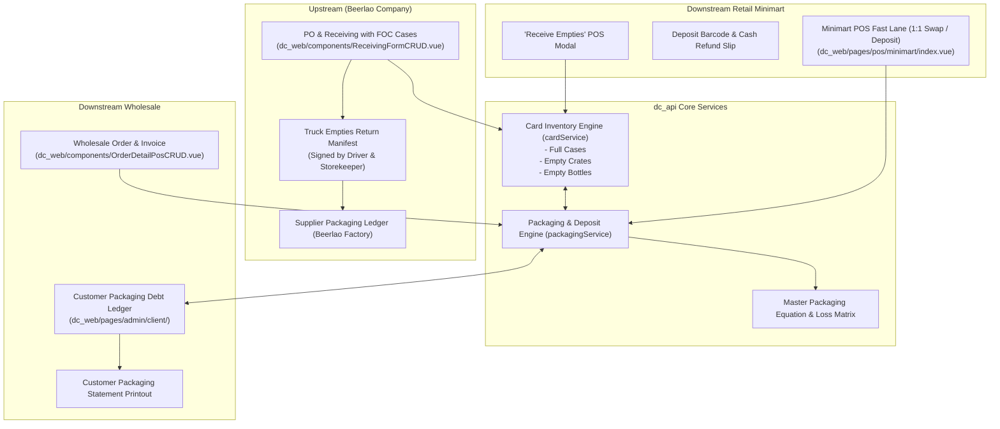

# Beerlao Agency: Packaging & Promotion Management System
## Technical Implementation Plan (Aligned with `dc_api` & `dc_web` Architecture)

---

## 1. System Context & Business Architecture

As an **Official Beerlao Agency (ຕົວແທນຈຳໜ່າຍເບຍລາວ)**, the business handles:
1. **Upstream (Beerlao Factory / Lao Brewery Co.)**:
   - Receiving bulk beer shipments with **Free Promotional / FOC Cases (ເບຍແຖມ)**.
   - Handing over empty crates/bottles to the delivery truck (Swap Manifest).
   - Tracking the running packaging balance with Lao Brewery Co.
2. **Downstream Wholesale (Restaurants, Sub-agents, Bars)**:
   - Selling full cases + giving customer promotion cases.
   - Collecting empties on route and maintaining **Customer Packaging Debt (ບັນຊີລັງ-ແກ້ວຕິດໜີ້)**.
3. **Downstream Retail Minimart POS**:
   - Fast 1:1 empties exchange at counter (ຍົກລັງປ່ຽນ).
   - Deposit receipts with barcode for customers taking packaging home.
   - Quick "Receive Empties" refund dialog.
4. **Internal Warehouse & Loss Tracking**:
   - Tracking glass breakages (ແກ້ວແຕກ) and damaged crates (ລັງຊຳລຸດ).

---

## 2. End-to-End System Architecture



---

## 3. Database Schema & Models (`dc_api`)

### 3.1 Migration: `YYYYMMDD_create_beerlao_agency_packaging_tables.sql`

```sql
-- 1. Product Packaging Definition (BOM for Returnable Items)
CREATE TABLE IF NOT EXISTS `product_packagings` (
  `id` INT AUTO_INCREMENT PRIMARY KEY,
  `productId` INT NOT NULL,                  -- Finished Beer Case ID
  `packagingProductId` INT NOT NULL,         -- Empty Crate ID or Empty Bottle ID
  `quantity` INT NOT NULL DEFAULT 1,         -- 1 for crate, 12 for bottles
  `depositPrice` DECIMAL(12, 2) DEFAULT 0.00,
  `companyId` INT NOT NULL,
  `createdAt` DATETIME NOT NULL,
  `updateTimestamp` DATETIME NOT NULL,
  INDEX `idx_pkg_product` (`productId`),
  INDEX `idx_pkg_packaging_product` (`packagingProductId`),
  CONSTRAINT `fk_pkg_product` FOREIGN KEY (`productId`) REFERENCES `product` (`id`) ON DELETE CASCADE,
  CONSTRAINT `fk_pkg_asset` FOREIGN KEY (`packagingProductId`) REFERENCES `product` (`id`) ON DELETE CASCADE
) ENGINE=InnoDB DEFAULT CHARSET=utf8mb4;

-- 2. Customer Packaging Debt Ledger (Wholesale & Retail)
CREATE TABLE IF NOT EXISTS `customer_packaging_ledger` (
  `id` INT AUTO_INCREMENT PRIMARY KEY,
  `clientId` INT NOT NULL,                   -- References `client` table
  `saleHeaderId` INT NULL,                   -- References `saleHeader` table
  `packagingProductId` INT NOT NULL,         -- Crate or Bottle
  `transactionType` ENUM('DELIVERED_OUT', 'RETURNED_IN', 'PAID_DEPOSIT', 'REFUNDED_DEPOSIT', 'WRITE_OFF') NOT NULL,
  `qtyChange` INT NOT NULL,                  -- (+) Customer owes more, (-) Customer returned
  `balanceAfter` INT NOT NULL,               -- Running balance customer owes
  `depositAmount` DECIMAL(12, 2) DEFAULT 0.00,
  `notes` VARCHAR(255) NULL,
  `userId` INT NOT NULL,
  `companyId` INT NOT NULL,
  `createdAt` DATETIME NOT NULL,
  `updateTimestamp` DATETIME NOT NULL,
  INDEX `idx_cpl_client` (`clientId`),
  INDEX `idx_cpl_sale` (`saleHeaderId`),
  CONSTRAINT `fk_cpl_client` FOREIGN KEY (`clientId`) REFERENCES `client` (`id`) ON DELETE CASCADE
) ENGINE=InnoDB DEFAULT CHARSET=utf8mb4;

-- 3. Supplier (Beerlao Factory) Packaging Ledger
CREATE TABLE IF NOT EXISTS `supplier_packaging_ledger` (
  `id` INT AUTO_INCREMENT PRIMARY KEY,
  `vendorId` INT NOT NULL,                   -- Lao Brewery Vendor ID
  `receivingHeaderId` INT NULL,              -- References `receivingHeader` table
  `manifestNo` VARCHAR(60) NULL,
  `packagingProductId` INT NOT NULL,
  `transactionType` ENUM('RECEIVED_FULL', 'RETURNED_EMPTY_TRUCK', 'FACTORY_ADJUSTMENT') NOT NULL,
  `qtyChange` INT NOT NULL,                  -- (+) Received from factory, (-) Handed to truck
  `balanceAfter` INT NOT NULL,               -- Running balance with Lao Brewery
  `notes` VARCHAR(255) NULL,
  `userId` INT NOT NULL,
  `companyId` INT NOT NULL,
  `createdAt` DATETIME NOT NULL,
  `updateTimestamp` DATETIME NOT NULL,
  INDEX `idx_spl_vendor` (`vendorId`),
  INDEX `idx_spl_rec` (`receivingHeaderId`)
) ENGINE=InnoDB DEFAULT CHARSET=utf8mb4;

-- 4. Packaging Damage & Loss Log
CREATE TABLE IF NOT EXISTS `packaging_damage_logs` (
  `id` INT AUTO_INCREMENT PRIMARY KEY,
  `packagingProductId` INT NOT NULL,
  `quantity` INT NOT NULL,
  `reason` ENUM('DELIVERY_BREAKAGE', 'WAREHOUSE_DAMAGE', 'FACTORY_REJECT') NOT NULL,
  `notes` VARCHAR(255) NULL,
  `userId` INT NOT NULL,
  `locationId` INT NOT NULL,
  `companyId` INT NOT NULL,
  `createdAt` DATETIME NOT NULL,
  `updateTimestamp` DATETIME NOT NULL
) ENGINE=InnoDB DEFAULT CHARSET=utf8mb4;

-- 5. Add FOC / Free Promotion support to Receiving Lines & PO Lines
ALTER TABLE `poLine` ADD COLUMN `focQty` DOUBLE DEFAULT 0 AFTER `qty`;
ALTER TABLE `receivingLine` ADD COLUMN `focQty` DOUBLE DEFAULT 0 AFTER `qty`;
ALTER TABLE `saleLine` ADD COLUMN `focQty` DOUBLE DEFAULT 0 AFTER `quantity`;
ALTER TABLE `saleLine` ADD COLUMN `packagingAction` ENUM('EXCHANGED', 'DEPOSIT', 'DEBT', 'NONE') DEFAULT 'NONE';

-- 6. Add Returnable flags to Product
ALTER TABLE `product` ADD COLUMN `isReturnablePackaging` TINYINT(1) DEFAULT 0;
ALTER TABLE `product` ADD COLUMN `isPackagingAsset` TINYINT(1) DEFAULT 0;
```

---

## 4. Step-by-Step Implementation Roadmap

### 📦 Phase 1: Upstream PO, Receiving & FOC Cases (`dc_api` & `dc_web`)

#### Goals:
* Support entering **Free Promotion Cases (ເບຍແຖມ)** in PO and Receiving.
* Record **Empties Handed to Beerlao Delivery Truck** during receiving.
* Maintain **Supplier Packaging Ledger (Beerlao Company)**.
* Generate printable **Truck Return Manifest**.

#### Files to Create / Modify:
1. **`dc_api/src/receiving/controller.js`**:
   - Update `create` and `updateById` transactions:
     - When receiving full cases: Total inventory `Card` count generated = `(line.qty + line.focQty)`.
     - Landed cost calculation: `effectiveCost = line.total / (line.qty + line.focQty)`.
     - Update `supplier_packaging_ledger` for both paid and FOC packaging items.
     - Process empty crates/bottles handed back to the truck (`cardService` deducts empty cards).
2. **`dc_web/components/ReceivingFormCRUD.vue`**:
   - Add **FOC Qty (ແຖມ)** column in the line items table.
   - Add **"ສົ່ງຄືນລັງ-ແກ້ວຂຶ້ນລົດໂຮງງານ (Truck Empties Return)"** section:
     - Crate count handed over to driver.
     - Bottle count handed over to driver.
     - Net packaging balance update.
3. **`dc_web/components/PDFReceiving/truckManifest.vue`**:
   - Printable Truck Return Manifest with signature lines for driver and storekeeper.

---

### 🏢 Phase 2: Downstream Wholesale & Customer Packaging Debt (`dc_web` & `dc_api`)

#### Goals:
* When selling to restaurants/sub-shops, record **Cases Delivered** vs **Empties Returned**.
* Track **Customer Packaging Debt (ບັນຊີລັງ-ແກ້ວຕິດໜີ້)** separately from financial debt.
* Support giving **Customer FOC Promo Cases** (e.g. Buy 50 cases get 1 free) while enforcing packaging return.

#### Files to Create / Modify:
1. **`dc_api/src/sales/controller.js` & `dc_api/src/sales/line/`**:
   - When creating a wholesale sale for a customer (`clientId`):
     - Calculate packaging out: `(qty + focQty) * crateRatio`.
     - If customer returned partial empties: Record difference in `customer_packaging_ledger`.
2. **`dc_web/components/OrderDetailPosCRUD.vue`**:
   - Add **FOC (ແຖມ)** input field per line item.
   - Add **"ຮັບລັງ-ແກ້ວຄືນຈາກລູກຄ້າ (Empties Returned by Customer)"** section on checkout.
   - Display customer's current packaging balance badge (e.g. `ຕິດໜີ້ລັງ: 45 ລັງ / 540 ແກ້ວ`).
3. **`dc_web/pages/admin/client/packagingStatement.vue`**:
   - Dedicated statement showing history of beer delivered, empties returned, and current packaging debt for any wholesale client.

---

### 🛒 Phase 3: Retail Minimart POS (`dc_web/pages/pos/minimart`)

#### Goals:
* **Fast-Lane Checkout**: Default to 1:1 swap (ຍົກລັງປ່ຽນ) without slowing down counter cashiers.
* **New Sale with Deposit**: Option to charge deposit fee and print deposit barcode.
* **"Receive Empties" Quick Button**: Scan deposit slip barcode or enter returned empties for instant cash refund.

#### Files to Create / Modify:
1. **`dc_web/pages/pos/minimart/index.vue`**:
   - Fast packaging dialog on scanning returnable items:
     - `[1] Empties Exchanged (ປ່ຽນແກ້ວ)` -> (Default, 1 tap).
     - `[2] Charge Deposit (ມັດຈຳລັງແກ້ວ)` -> (Adds deposit line to cart).
     - `[3] Partial / Custom`.
   - Add header button: `[ 📦 ຮັບຄືນລັງ-ແກ້ວ / Return Empties ]`.
2. **`dc_api/src/pos/packagingReturn.controller.js`**:
   - API endpoint `POST /api/v1/pos/packaging/return` to process returns and adjust cashier shift drawer balance.
3. **Receipt Print Template**:
   - Display deposit claim barcode on thermal receipt.

---

### 📊 Phase 4: Master Packaging Reconciliation & Breakage Matrix

#### Goals:
* Provide agency management with a single-screen **Master Packaging Balance Matrix**:
  $$\text{Agency Crates Owned} = \text{Warehouse Crates} + \text{Wholesale Debt} + \text{Retail Deposits} + \text{Damaged} - \text{Beerlao Quota}$$
* Track breakage logs for claiming damaged goods.

#### Files to Create:
1. **`dc_web/pages/admin/report/masterPackagingMatrix.vue`**:
   - Real-time KPI cards:
     - Full Cases in Stock.
     - Empty Crates & Bottles in Warehouse.
     - Crates with Wholesale Customers (Debt).
     - Active Deposits with Walk-in Customers.
     - Balance with Beerlao Factory.
2. **`dc_web/pages/admin/report/supplierPromoSummary.vue`**:
   - Summary of free promotional cases received vs expected quota from Lao Brewery.
3. **`dc_web/pages/admin/inventory/damageLog.vue`**:
   - Breakage & Damaged Crate logging form.

---

## 5. Technical Deliverables Summary Table

| Module | Files Impacted | Key Changes |
| :--- | :--- | :--- |
| **Database** | `dc_api/migrations/` | 4 new tables (`product_packagings`, `customer_packaging_ledger`, `supplier_packaging_ledger`, `packaging_damage_logs`) + column alters. |
| **PO & Receiving** | `dc_api/src/receiving/`, `dc_web/components/ReceivingFormCRUD.vue` | FOC promo cases handling, effective landed cost blending, truck empty crate swap. |
| **Wholesale POS** | `dc_api/src/sales/`, `dc_web/components/OrderDetailPosCRUD.vue` | Customer packaging debt ledger, FOC line items, customer statement printout. |
| **Retail POS** | `dc_web/pages/pos/minimart/index.vue` | 1-tap 1:1 exchange modal, deposit barcode printing, standalone "Receive Empties" dialog. |
| **Reports** | `dc_web/pages/admin/report/` | Master Packaging Balance Matrix, Supplier Promo Rebate Reconciliation, Customer Statement. |
